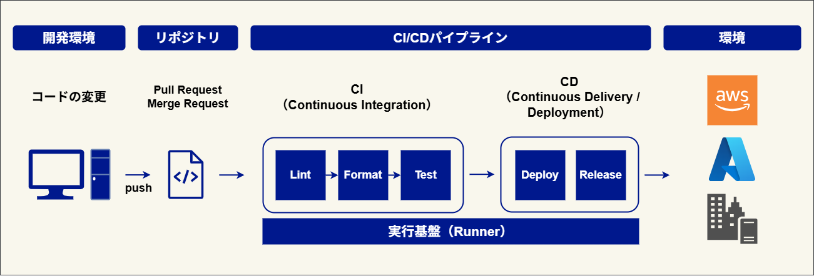

# 1. 基礎編（概要理解）

## 1. この章の目的

この章では、CI/CDの全体像を理解します。  
ここでは細かい設定方法やツールの使い方までは扱わず、まずは「CI/CDとは何か」「なぜ必要か」「どのような流れで動くのか」をつかむことを目的とします。

この章で押さえたいのは、次の3点です。

- CI/CDは変更を安全に扱うための仕組みであること
- CIとCDにはそれぞれ役割の違いがあること
- 今回のプラクティスで何を実現するのかを理解すること

## 2. CI/CDとは何か

CI/CDは、ソフトウェア開発やインフラ構築における一連の作業を自動化する仕組みです。  
コードを変更したあとに、その内容を確認し、問題がなければ環境へ反映するまでの流れを継続的に実行できるようにします。

たとえば、これまで手作業で行っていた次のような作業を自動化します。

- 変更内容のチェック
- テストや検証
- デプロイ（環境への反映）

手作業を減らすことで、作業ミスを防ぎ、変更をより安全かつ素早く扱えるようになります。

## 3. CIとCDの違い

CIとCDはまとめて語られることが多いですが、役割は異なります。

| 項目 | 意味                             | 役割                           | 例                                           |
| ---- | -------------------------------- | ------------------------------ | -------------------------------------------- |
| CI   | Continuous Integration           | 変更内容を継続的に検証する     | テスト、lint、terraform init、terraform plan |
| CD   | Continuous Delivery / Deployment | 検証済みの変更を環境へ反映する | terraform apply、アプリのデプロイ            |

CIは、変更によって問題が起きていないかを確認するための仕組みです。
一方でCDは、確認した変更を実際の環境へ反映するための仕組みです。

## 4. なぜCI/CDが必要か

CI/CDがない場合、変更のたびに手動で確認や反映を行うことになります。
このやり方では、手順漏れや操作ミスが起きやすく、作業者によって品質にもばらつきが出やすくなります。

一方で、CI/CDを導入すると、変更のたびに同じ手順で自動的に確認と反映を実行できます。
その結果、品質を安定させやすくなり、変更に対する不安も小さくなります。

CI/CDがある場合とない場合を比べると、次のような違いがあります。

| 観点                     | CI/CDなし    | CI/CDあり                            |
| ------------------------ | ------------ | ------------------------------------ |
| コードの確認作業         | 手動         | 一部自動                             |
| 手順のばらつき           | 発生しやすい | 起きにくい                           |
| ミスの発見               | 遅れやすい   | 早く見つけやすい                     |
| デプロイ（環境への反映） | 手動実行     | 条件に応じて自動または手動で制御可能 |

## 5. CI/CDの基本的な流れ

CI/CDでは、一般的にコードの変更をリポジトリに反映したことをきっかけに処理が始まります。
まずCIによって変更内容の検証が行われ、その結果に問題がなければ、次にCDによって環境への反映が行われます。

基本的な流れは次のとおりです。

1. コードを変更する
2. リモートリポジトリ（GitHub や GitLab）に push する
3. 必要に応じて Pull Request (GitHub) / Merge Request (GitLab) を作成する
4. push や Pull Request / Merge Request をきっかけにCIが実行される
5. 問題がなければCDが実行される
6. 環境に変更が反映される

このとき、CI/CDの処理はリモートリポジトリ上で直接動くのではなく、処理を実行するための環境で実行されます。  
たとえば、テストや各種コマンドの実行も、その環境の中で行われます。

GitHub Actions や GitLab CI/CD では、この実行環境のことを Runner と呼びます。

## 6. CI/CDを実現するツール

CI/CDを実現するためのツールは1つではありません。
開発現場では、利用しているリポジトリ管理サービスや運用方針に応じて、さまざまなツールが使われています。

代表的なものとしては、次のようなツールがあります。

- GitHub Actions
- GitLab CI/CD
- Jenkins
- CircleCI
- Azure Pipelines
- AWS CodePipeline

どのツールを使う場合でも、コードの変更をきっかけに検証を実行し、必要に応じて環境への反映までつなげる、という基本的な考え方は共通しています。

このプラクティスでは、その中でも GitHub Actions と GitLab CI/CD を扱います。
どちらも広く使われているCI/CDツールであり、基本的な考え方を学ぶ題材として適しています。

また、検証やデプロイの題材として Terraform を利用し、変更先の環境として AWS を扱います。

ここまでで、CI/CDの基本的な考え方と全体の流れ、そして今回扱うツールの位置づけを確認しました。  
この基礎編では、まず**CIは変更を検証する仕組み**、**CDは変更を反映する仕組み**であることを押さえられていれば十分です。
